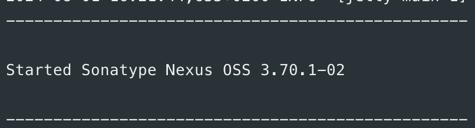
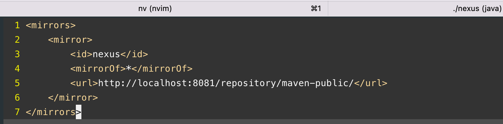
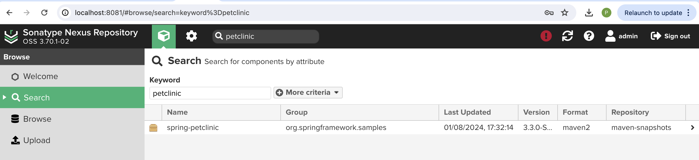

### After installing nexus repository manager, I started it with the following command:


```bash
./nexus run
```



### Next I accessed user interface on http://localhost:8081:


### I logged in with the default credentials:


### Setting up a proxy repository


#### Maven proxy repository


updating .m2/settings.xml



#### Gradle configuration

build.gradle

```gradle
repositories {
    maven {
        url 'http://localhost:8081/repository/maven-public/'
    }
}
```

and added publish plugin

```gradle
apply plugin: 'maven-publish'
```


### Uploading maven artifact 

```bash
mvn deploy
```



### Uploading artifact using gradle

```bash
./gradlew publish
```


